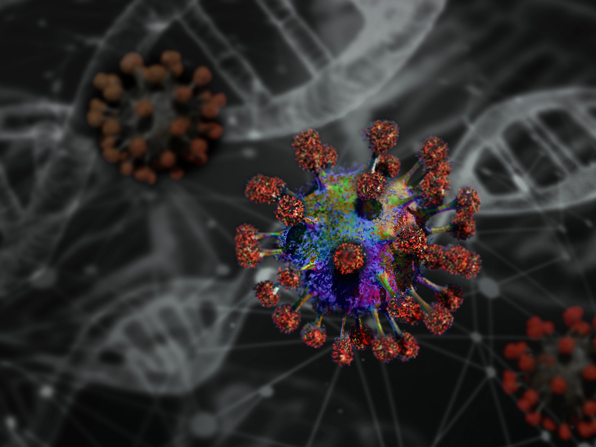

# Viral Breakout 

Every since the (arguably) deadly coronavirus, the world has been scambling to create biological weapons that could wreak targeted havoc at enemy nations. The univerisity of Canely had been working on a supercharged version of coronavirus, codename Amstelvirus. Unfortunately, an intern who had been working on the project chose a weak password (canely123) and a rival company hacked the system, stealing all the research data. They are arranging to sell the data on the noir markert to the highest bidder.

The team at the university of Canely approached Coventry University, knowing they had the most elite hackers in the nation, and requested for a team to execute a hack back. It is your mission to infiltrate the rival companies server and steal back the research data.

Good luck, the world is counting on you.

